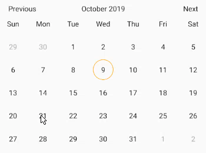
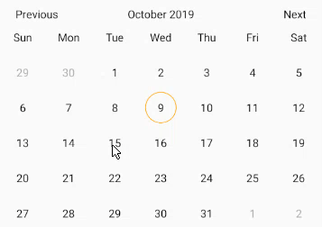
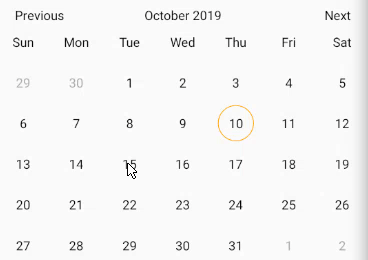

# React-Native-Plain-Calendar
This module includes customizable and flexibility react-native calendar component with possibility implement own picker or use existing in it.

## Installation
```bash
npm i --save react-native-plain-calendar
```
The solution is implemented in TypeScript so no native module linking is required.

## Examples





## Usage

The simplest usage of this calendar component

```javascript 
import React from 'react';
import { View } from 'react-native';
import { Calendar } from 'react-native-plain-calendar';

export default const App = () => (
  <View>
    <Calendar />
  </View>
);
```
Simple usage of picker

```javascript 
import React from 'react';
import { View } from 'react-native';
import { Calendar } from 'react-native-plain-calendar';

export default const App = () => (
  function onSelected ({ selected, selectedStart, selectedEnd }) {
    // Your code
  }


  <View>
    <Calendar.Picker 
      onSelected={onSelected} 
      selectedType='single-range' 
    />
  </View>
);
```

Usage with custom header and day components

```javascript 
import React from 'react';
import { View } from 'react-native';
import { Calendar } from 'react-native-plain-calendar';
import { CustomHeaderComponent, CustomDayComponent } from './components'

export default const App = () => (
  <View>
    <Calendar.Picker
      disabledDates={[new Date('10/01/2020'), new Date('11/01/2020'), new Date('12/01/2020')]}
      HeaderComponent={({
        currentMonth,
        onPrevMonth,
        onNextMonth,
      }) => (
        <CustomHeaderComponent
          onPressLeft={onPrevMonth}
          title={currentMonth}
          onPressRight={onNextMonth}
        />
      )}
      DayComponent={({
        isToday,
        isSelectedDate,
        isSingleSelectedDate,
        isStartSelectedDate,
        isEndSelectedDate,
        isIntermediateSelectedDate,
        isDisabledDate,
        isDisabledParticularDate,
        date,
        onPress,
      }) => (
        <CustomDayComponent
          isToday={isToday}
          isSelectedDate={isSelectedDate}
          isSingleSelectedDate={isSingleSelectedDate}
          isStartSelectedDate={isStartSelectedDate}
          isEndSelectedDate={isEndSelectedDate}
          isIntermediateSelectedDate={isIntermediateSelectedDate}
          isDisabledDate={isDisabledDate}
          isDisabledParticularDate={isDisabledParticularDate}
          date={date}
          onPress={onPress}
        />
      )}
    />
  </View>
);
```

## Calendar props

TODO: describe more components and functions

| Prop                           | Type                    | Description                                                                                                                                                                                                   | Default     |
| :----------------------------- | :---------------------- | :------------------------------------------------------------------------------------------------------------------------------------------------------------------------------------------------------------ | :---------- |
| onDayPress                     | `function` | Callback which called when day pressed `function (date: Date)`                                                                                                                                                                   | -           |
| initialDate                    | `Date`                  | The date that the calendar opens to when it will be mounted                                                                                                                                                   | -           |
| selectedDate                   | `Date`                  | The date which will be marked as selected single date                                                                                                                                                         | -           |
| startSelectedDate              | `Date`                  | The date which will be marked as begin date of the range                                                                                                                                                      | -           |
| endSelectedDate                | `Date`                  | The date which will be marked as end date of the range                                                                                                                                                        | -           |
| minDate                        | `Date`                  | Minimum date that can be selected                                                                                                                                                                             | -           |
| maxDate                        | `Date`                  | Maximum date that can be selected                                                                                                                                                                             | -           |
| disabledDates                  | `Date[]`                | Array of disabled days                                                                                                                                                                                        | `[]`          |
| headerDateFormat               | `string`                | The format of the date in the header. react-native-simple-calendar is using the library 'date-fns'. More information about supported dates formats you can find here: https://date-fns.org/v2.2.1/docs/format | `'MMMM yyyy'` |
| headerContainerStyle           | `style`                 | The style of the header container(View)                                                                                                                                                                       | -           |
| headerTitleStyle               | `style`                 | The style of the header title(Text)                                                                                                                                                                           | -           |
| headerButtonStyle              | `style`                 | The style of the header button container(View)                                                                                                                                                                | -           |
| HeaderButtonComponent          | `component`             | Takes a component and renders it instead of default header button component                                                                                                                                   | -           |
| HeaderComponent                | `component`             | Takes a component and renders it instead of default header component                                                                                                                                          | -           |
| WeekdaysComponent                   | `null`                | Pass `hull` to hide the weekdays component                                                                                                                            | -           |
| weekStartsOn                   | `number`                | The index of the first day of the week (0 - Sunday, 1 - Monday, 2 - Tuesday, etc )                                                                                                                            | `0`           |
| weekdays                       | `string[]`              | List of days of the week. In the list  Must be 7 days and begin from Sunday                                                                                                                                   | `[]`          |
| weekContainerStyle             | `style`                 | The style of the week container(View)                                                                                                                                                                         | -           |
| weekdayContainerStyle          | `style`                 | The style of the day container of the week(View)                                                                                                                                                              | -           |
| weekdayStyle                   | `style`                 | The style of the day of the week(Text)                                                                                                                                                                        | -           |
| cellsStyle                     | `style`                 | The style of the cells component(View)                                                                                                                                                                        | -           |
| daysRowStyle                   | `style`                 | The style of the rows that contains days of the week in cells (View)                                                                                                                                          | -           |
| dayContainerStyle              | `style`                 | The style of the day wrapper(container) component(View)                                                                                                                                                       | -           |
| DayComponent                   | `component`             | Takes a component and renders it instead of default day component.                                                                                                                                         | -           |
| todayStyle                     | `style`                 | The style of the today(View)                                                                                                                                                                                  | -           |
| dayStyle                       | `style`                 | The style of the day(View)                                                                                                                                                                                    | -           |
| daySelectedStyle               | `style`                 | The style of the selected day(View)                                                                                                                                                                           | -           |
| daySingleSelectedStyle         | `style`                 | The style of the single selected day(View)                                                                                                                                                                    | -           |
| dayStartSelectedStyle          | `style`                 | The style of the start selected day (day at the begin of the range)(View)                                                                                                                                     | -           |
| dayEndSelectedStyle            | `style`                 | The style of the end selected day (day at the end of the range)(View)                                                                                                                                         | -           |
| dayIntermediateSelectedStyle   | `style`                 | The style of the intermediate selected day (day within start and end selected days)(View)                                                                                                                     | -           |
| dayDisabledStyle               | `style`                 | The style of the disabled day(View)                                                                                                                                                                           | -           |
| dayDisabledParticularStyle     | `style`                 | The style of the disabled particular day (days that passed in disabledDates props)(View)                                                                                                                      | -           |
| todayTextStyle                 | `style`                 | The style of the today text(Text)                                                                                                                                                                             | -           |
| dayTextStyle                   | `style`                 | The style of the day text(Text)                                                                                                                                                                               | -           |
| daySelectedTextStyle           | `style`                 | The style of the selected day text(Text)                                                                                                                                                                      | -           |
| dayDisabledTextStyle           | `style`                 | The style of the disabled day text(Text)                                                                                                                                                                      | -           |
| dayDisabledParticularTextStyle | `style`                 | The style of the disabled particular day text(Text)                                                                                                                                                           | -           |
| disabledDayPick                | `boolean`               | Disable onDayPress                                                                                                                                                                                            | `true`        |

## Calendar.Picker props

Takes the same props as Calendar and also takes extra props

| Prop         | Type                                                                                             | Description                                                                     | Default |
| :----------- | :----------------------------------------------------------------------------------------------- | :------------------------------------------------------------------------------ | :------ |
| selectedType | one of `'single','range','single-range'`                                                                 | The type of picker                                                              | -       |
| onSelected   | `function` | Callback which called when all dates will be selected depends on `selectedType`.| -       |


## License
[MIT](LICENSE) © Yura Pelehatiy 2019


